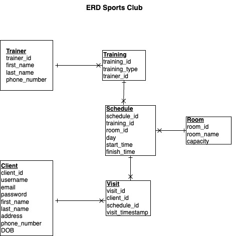

## T2A2 - API Webserver Project

## Sports Club API

[Github repository](https://github.com/mogoziri/T2A2_sports_club_api)

### R1, R2 Identification of the _problem_ you are trying to solve by building this particular _app_ and why is it a _problem_ that needs solving?

In modern realities, people have less and less time to monitor their physical form. We use transport instead of walking, many types of work have switched completely to a remote mode. Most of the sports centers involve the purchase of a club membership and is a problem for many people, as the price is too high. The purpose of this work is to develop an application for a sports club that provides sports training on an hourly basis. You can only pay for the workouts you actually attended. As a result, it is expected that more people will be able to afford to improve their physical fitness

### R3 Why have you chosen this database system. What are the drawbacks compared to others?

PostgreSQL is a free open-source relational database managements system that was used when building the Sports Club application. It was first released in 1996 by Michael Stonebraker and his team. PostgreSQL is considered a suitable solution for complex operations with large amounts of data.

There are several reasons that influenced the choice of database system:

1. PostgreSQL supports the most data types such as numeric, text, boolean, as well as json, binary and others.
2. The maximum size of the database is not limited.
3. High reliability and compliance with ACID principles
4. It works on most common platforms such as UNIX, Windows.
5. PostgreSQL is free, open-source and it has large user community, any new bugs are quickly identified and fixed.
6. If necessary, it's possible to add your own type conversions, domains, indexes, operators, procedural languages, and so on.

The drawbacks compared to others:

1. PostgreSQL should not be used when processing speed is important or you have a simple project in which there are no requirements for increased reliability.
2. Another disadvantage can be considered the complexity of the system, it's settings.

### R4 The key functionalities and benefits of an ORM

ORM is a connecting link between Python and a SQL database. SQLAlchemy is a popular Python SQL toolkit and ORM. It allows Python to interact with different SQL data base system (for example, PostgreSQL). The library was released in February 2006 under the MIT open source license.
Key features of SQLAlchemy:

- Using an ORM is optional
- High Performing Architecture
- Modular and Extensible
- Creating queries using Python functions and expressions
- Support for relationships between classes, including one-to-many and many-to-many
- Additional ability to separately define object mapping and classes
- Pre- and post-processing of data

The main advantages of using SQLAlchemy include:

1.  Security - query parameters are escaped.
2.  Performance - Increases the likelihood of reusing a query to the
    database server.
3.  Adaptation - SQLAlchemy allows you to write Python code that is compatible with several back-end DBMS.

### R5 Endpoints for Sports Club API

|         Route         |                            Description                            | HTTP Method |                                Required data                                 |                                 Requires authentication                                  |                                                                            Expected response data                                                                            |
| :-------------------: | :---------------------------------------------------------------: | :---------: | :--------------------------------------------------------------------------: | :--------------------------------------------------------------------------------------: | :--------------------------------------------------------------------------------------------------------------------------------------------------------------------------: |
|     **/trainers**     |              Getting information about all trainers               |     GET     |                                      No                                      |                                            No                                            |                                                                       Returning a list of all trainers                                                                       |
|   **/trainers/id**    |                 Getting information about trainer                 |     GET     |                                  trainer_id                                  |                                            No                                            |                                                                Returning the information about trainer by id                                                                 |
|     **/trainers**     |                       Adding a new trainer                        |    POST     |                     first_name, last_name, phone_number                      |                      Yes, only sports club admin can add an entity                       |                                   Returning a message about successfully added trainer or an error in case if you don't have admin rights                                    |
|   **/trainers/id**    |                Updating information about trainer                 |     PUT     |                                  trainer_id                                  |                     Yes, only sports club admin can update a trainer                     |                                  Returning a message about successfully updated trainer or an error in case if you don't have admin rights                                   |
|   **/trainers/id**    |                        Deleting a trainer                         |   DELETE    |                                  trainer_id                                  |                     Yes, only sports club admin can delete an entity                     |                                  Returning a message about successfully deleted trainer or an error in case if you don't have admin rights                                   |
|    **/clients/id**    |                 Getting information about client                  |     GET     |                                  client_id                                   |             Yes, only sports club admin can get information about an entity              |                                                                   Returning information about client by id                                                                   |
|    **/clients/id**    |                 Updating information about client                 |     PUT     |                                  client_id                                   |                 Yes, only client can update information about an entity                  |                                                          Returning a message about successfully updated information                                                          |
|    **/clients/id**    |                         Deleting a client                         |   DELETE    |                                  client_id                                   |                  Yes, only admin can delete information about an entity                  |                                   Returning a message about successfully deleted client or an error in case if you don't have admin rights                                   |
|  **/auth/register**   |                       Register a new client                       |    POST     | username, email, password, first_name, last_name, address, phone_number, dob |                                                                                          |                                  Client's username and token in case of successful registration registered in the system or failure reason                                   |
|    **/auth/login**    |                          Client's login                           |    POST     |                              username, password                              |                                                                                          |                                       Client's username and token in case of successful authentication in the system or failure reason                                       |
| **/auth/admin/login** |                           Admin's login                           |    POST     |                              username, password                              |                                                                                          |                                              Admin's username and token in case of successful authentication or failure reason                                               |
|    **/trainings**     |              Getting information about all trainings              |     GET     |                                      No                                      |                                            No                                            |                                                                        Returning a list of trainings                                                                         |
|   **/trainings/id**   |            Getting information about a training by id             |     GET     |                                 training_id                                  |                                            No                                            |                                                                  Returning information about training by id                                                                  |
|    **/trainings**     |                       Adding a new training                       |    POST     |                          training_type, trainer_id                           |             Yes, only sports club admin can add information about an entity              |                        Returning a message about successfully added information about new training or an error in case if you don't have admin rights                        |
|   **/trainings/id**   |             Updating information about training by id             |     PUT     |                          training_type, trainer_id                           |     Yes, only sports club admin can update the training information in the database      |                      Returning a message about successfully updated information about training by id or an error in case if you don't have admin rights                      |
|   **/trainings/id**   |             Deleting information about training by id             |   DELETE    |                                 training_id                                  |     Yes, only sports club admin can delete the training information in the database      |                        Returning a message about successfullydeleted information about training_id or an error in case if you don't have admin rights                        |
|      **/visit**       |               Getting information about all visits                |     GET     |                                      No                                      |  Yes, only sports club admin can view the information about all visits in the database   |                                                Returning a list of visits or an error in case if you don't have admin rights                                                 |
|     **/visit/id**     |               Getting information about visit by id               |     GET     |                                   visit_id                                   | Yes, only sports club admin or user can view the information about visit in the database |                                      Returning information about visit_id or an error in case if you don't have client or admin rights                                       |
|      **/visit**       | Adding a new visit and checking if room capacity is allowing this |    POST     |                            client_id, schedule_id                            |              Yes, only sports club admin can add information about a visit               | Returning a message about successfully added visit or an error in case if you don't have admin rights. If room capacity is exceeded return an error "Room capacity exceeded" |
|     **/visit/id**     |                 Updating information about visit                  |     PUT     |                            client_id, schedule_id                            |             Yes, only sports club admin can update information about a visit             |                                Returning a message about successfully updated visit or return an error in case if you don't have admin rights                                |
|     **/schedule**     |           Getting all schedule items from the database            |     GET     |                                      No                                      |                                            No                                            |                                                                      Returning a list of schedule items                                                                      |
|   **/schedule/id**    |          Getting a schedule item by id from the database          |     GET     |                                 schedule_id                                  |                                            No                                            |                                                     Returning information about a schedule item by id from the database                                                      |
|     **/schedule**     |            Posting a new schedule item to the database            |    POST     |              training_id, room_id, day, start_time, finish_time              |        Yes, only sports club admin can add information about a new schedule item         |                                Returning a message about successfully added schedule item or an error in case if you don't have admin rights                                 |
|   **/schedule/id**    |                  Updating a schedule item by id                   |     PUT     |              training_id, room_id, day, start_time, finish_time              |         Yes, only sports club admin can update information about a schedule item         |                               Returning a message about successfully updated schedule item or an error in case if you don't have admin rights                                |
|   **/schedule/id**    |                  Deleting a schedule item by id                   |   DELETE    |                                 schedule_id                                  |         Yes, only sports club admin can delete information about a schedule item         |                               Returning a message about successfully deleted schedule item or an error in case if you don't have admin rights                                |

### R6 An ERD for Sports Club _app_

### R7 Third party services that Sports Club _app_ will use

#### The Sports Club App uses the following third party packages:

- Flask - it is a microframework for creating a simple and fast project in the Python programming language with the ability to scale to complex applications.
- SQLAlchemy - it is a connecting link between Python and a SQL database.
- psycopg2 - it is a PostgreSQL database adapter for the Python.
- marshmallow - this library allows you to define a data schema, indicating in it all the fields we need and the relationships between them.
- bcrypt - library with an adaptive cryptographic key derivation hash function used to securely store passwords.
- jwt-extended - this library used for managing JWT tokens.

### R8 Describe your projects _models_ in terms of the relationships they have with each other

Models and associations:

- Sports club offers different trainings to clients.
- Each training is lead by single trainer, and trainer can have multiple trainings.
- Sports club organises trainings in multiple schedule items meaning training is held on a particular day and time, each schedule item has one training associated with them.
- Each schedule item is held in a room and one room can have many schedule items held in it.
- Sports club has multiple clients. Clients can register to a scheduled item - this registration is described as visit. Clients can have multiple visits, and schedule item can have multiple visits, but single visit can have only one client and one training associated with it.

### R9 Discuss the database relations to be implemented in your application

#### Trainer:

Each `trainer` has a 1-to-many relationship with `trainings`: a trainer can conduct several training sessions.

#### Client:

Each `client` has 1-to-many relationship with `visit`: a client can have many visits in Sports Club

#### Trainings

Each `training` has 1-to-many relationship with `schedule`: this means that the training can appear in the schedule several times

#### Visit

Each `visit` has many-to-1 relationship with `client`: multiple visits can belong to the same client.
Each `visit` has many-to-1 relationship with `schedule`: many visits can have the same schedule item

#### Schedule

Each `schedule` has 1-to-many relationship with `visit`: one schedule item can be attended several times.
Each `schedule` has many-to-1 relationship with `trainings`: several schedule items can have the same training.

#### Room

Each `room` has 1-to-many relationship with `schedule`: one room can appear in the schedule several times

### R10 Describe the way tasks are allocated and tracked in your project

I used Trello to plan and track the workflow for the application. Trello is a visual tool that helps you to manage projects, workflows, and tasks of all types. Allows you to build workflows both individually and for teams.
Below you can find my project implementation board consisting of 4 sections: To Do, In Progress, Done, Paused.

